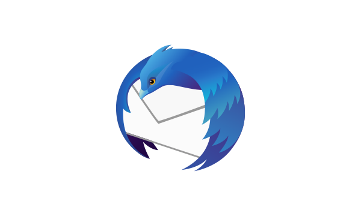

Thunderbird 60 marks the launch of a new product identity system that reflects the Photon design vision.  The first elements available in this system are the app icons for Thunderbird. These retain familiar elements of past app icons (like the fox and globe) but signal the profound changes in the product with bold colors and simplified shapes from the Photon Design System.

## Logo

[VIEW HIGH-RES](../images/product-identity-assets/thunderbird.png)

All product icons are available for download as SVG, PDF and PNG.

> [
> Download all Thunderbird logos \\
> 241 KB (.zip)](../images/product-identity-assets/thunderbird-assets.zip)

## Using Icons with Thunderbird Wordmarks or Logos

### Standard Horizontal Lockup

<figcaption markdown="1">Download [.svg](../images/product-identity-assets/thunderbird-wordmark-horizontal.svg), [.pdf](../images/product-identity-assets/thunderbird-wordmark-horizontal.pdf), or [.png](../images/product-identity-assets/thunderbird-wordmark-horizontal.png)
</figcaption>

Use app icons with Thunderbird and other product designators appearing to the right as the preferred lockup.

### Alternative Stacked Lockup

<figcaption markdown="1">Download [.svg](../images/product-identi.ty-assets/thunderbird-wordmark-vertical.svg), [.pdf](../images/product-identity-assets/thunderbird-wordmark-vertical.pdf), or [.png](../images/product-identity-assets/thunderbird-wordmark-vertical.png)
</figcaption>

Use the Thunderbird icon with Thunderbird below when horizontal space is an issue.

### Icons as Logo

<figcaption markdown="1">Download [.svg](../images/product-identity-assets/thunderbird-logo.svg), [.pdf](../images/product-identity-assets/thunderbird-logo.pdf), or [.png](../images/product-identity-assets/thunderbird-logo.png)
</figcaption>

Use app icons as logos without wordmarks only when the Thunderbird appears in close proximity to the icon.

### Icon as Glyph

<figcaption markdown="1">Download [.svg](../images/product-identity-assets/thunderbird-watermark.svg), [.pdf](../images/product-identity-assets/thunderbird-watermark.pdf), or [.png](../images/product-identity-assets/thunderbird-watermark.png)
</figcaption>

Use the one color icon when you need to represent Thunderbird with less emphasis than found in the full color icon.

This can occur in situations where you need to match an existing style in certain UI contexts; for example the de-emphasized Thunderbird icon for product messaging found on the New Tab page.

### Icons Dos and Dont’s



<figcaption>Use the icons provided, without modification</figcaption>



<figcaption>Reverse icons</figcaption>



<figcaption>Use just a portion of the icon</figcaption>



<figcaption>Use previous icons</figcaption>

## Additional Guidelines

Icons files containing our trademarks are available under the following licenses: vector logo files under [CC-BY 3.0](https://creativecommons.org/licenses/by-sa/3.0/) or later; bitmap logo files under [MPL 2](https://www.mozilla.org/en-US/MPL/2.0/). By using these, you agree that you will not:

* make an icon or lockup the most distinctive or prominent feature on a non-Thunderbird website, printed material or other content

* use our logos in a way that suggests any type of association or partnership with Thunderbird or approval, sponsorship or endorsement by Thunderbird (unless allowed via a license from us)

* use our logos in a way that is harmful, deceptive, obscene or otherwise objectionable to the average person

* use our logos on websites or other places containing content associated with hate speech, pornography, gambling or illegal activities

* use our logos to, or in connection with, content that disparages us or sullies our reputation.
